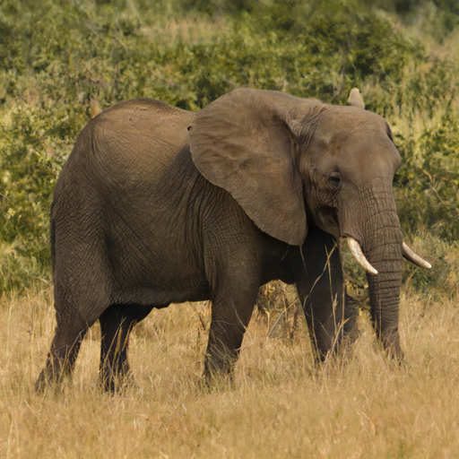
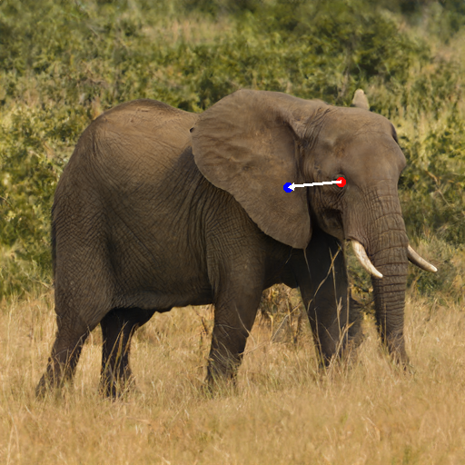
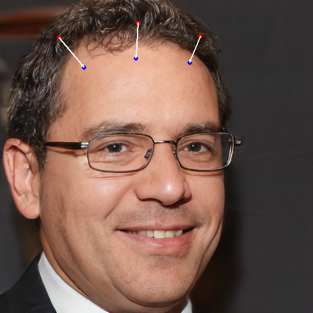

<!-- <link rel="stylesheet" type="text/css" href="./resources/style.css" media="screen" /> -->

<p align="center">
  
</p>

# FreeDrag: Point Tracking is Not You Need for Interactive Point-based Image Editing

<div style="display: flex; flex-wrap: wrap; gap: 10px; text-align: center">
  <div class="img-with-text">
      
      <figcaption style="font-size:20px">Original</figcaption>
  </div>
  <div class="img-with-text">
      
      <figcaption style="font-size:20px">User edit</figcaption>
  </div>
  <div class="img-with-text">
      
      <figcaption style="font-size:20px">DragGAN</figcaption>
  </div>
  <div class="img-with-text">
      
      <figcaption style="font-size:20px">FreeDrag</figcaption>
  </div>
</div>

<!--
<div style="display: flex; flex-wrap: wrap; gap: 10px; text-align: center; justify-content: center;">
  <div class="img-with-text">
      
      <figcaption style="font-size:20px">Original</figcaption>
  </div>
  <div class="img-with-text">
      
      <figcaption style="font-size:20px">User edit</figcaption>
  </div>
  <div class="video-with-text">
      <video width="240" height="240" controls>
          <source src="./resources/examples/face_233/DragGAN.mp4">
      </video>
      <figcaption style="font-size:20px">DragGAN</figcaption>
  </div>
  <div class="video-with-text">
      <video width="240" height="240" controls>
          <source src="./resources/examples/face_233/FreeDrag.mp4">
      </video>
      <figcaption style="font-size:20px">FreeDrag</figcaption>
  </div>
</div> 
-->

Official implementation of **FreeDrag: Point Tracking is Not You Need for Interactive Point-based Image Editing**.
- *Authors*: Pengyang Ling*, [Lin Chen*](https://lin-chen.site), [Pan Zhang](https://panzhang0212.github.io/), Huaian Chen, Yi Jin
- *Institutes*: University of Science and Technology of China; Shanghai AI Laboratory
- [[Paper]](https://arxiv.org/abs/2307.04684) [[Project Page]](https://lin-chen.site/projects/freedrag) [Web Demo]

This repo proposes FreeDrag, a novel interactive point-based image editing framework free of the laborious and unstable point tracking process🔥🔥🔥.

## Abstract
To serve the intricate and varied demands of image editing, precise and flexible manipulation of image content is indispensable. Recently, DragGAN has achieved impressive editing results through point-based manipulation. 
However, we have observed that DragGAN struggles with miss tracking, where DragGAN encounters difficulty in effectively tracking the desired handle points, and ambiguous tracking, where the tracked points are situated within other regions that bear resemblance to the handle points. To deal with the above issues, we propose **FreeDrag**, which adopts a feature-oriented approach to free the burden on point tracking within the point-oriented methodology of DragGAN. The **FreeDrag** incorporates adaptive template features, line search, and fuzzy localization techniques to perform stable and efficient point-based image editing. Extensive experiments demonstrate that our method is superior to the DragGAN and enables stable point-based editing in challenging scenarios with similar structures, fine details, or under multi-point targets. 


## 📜 News
[2023/7/11] The [paper](https://arxiv.org/abs/2307.04684) and [project page](https://lin-chen.site/projects/freedrag) are released!

## 💡 Highlights
- [ ] WebUI of FreeDrag
- [ ] Diffusion-based FreeDrag
- [ ] FreeDrag anything **3D**

## 🛠️Usage
**The demo and detailed code will be released in this or next week, please stay tuned🔥!**

## ❤️Acknowledgments
- [DragGAN](https://github.com/XingangPan/DragGAN/)
- [DragDiffusion](https://yujun-shi.github.io/projects/dragdiffusion.html)
- [StyleGAN3](https://github.com/NVlabs/stylegan3)

## ✒️ Citation
If you find our work helpful for your research, please consider citing the following BibTeX entry.
```bibtex
@InProceedings{ling2023freedrag,
            title = {FreeDrag: Point Tracking is Not You Need for Interactive Point-based Image Editing},
            author = {Pengyang Ling and Lin Chen and Pan Zhang and Huaian Chen and Yi Jin},
            booktitle = {arXiv preprint arXiv:2307.04684},
            year = {2023},
}
```
