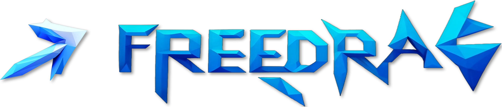
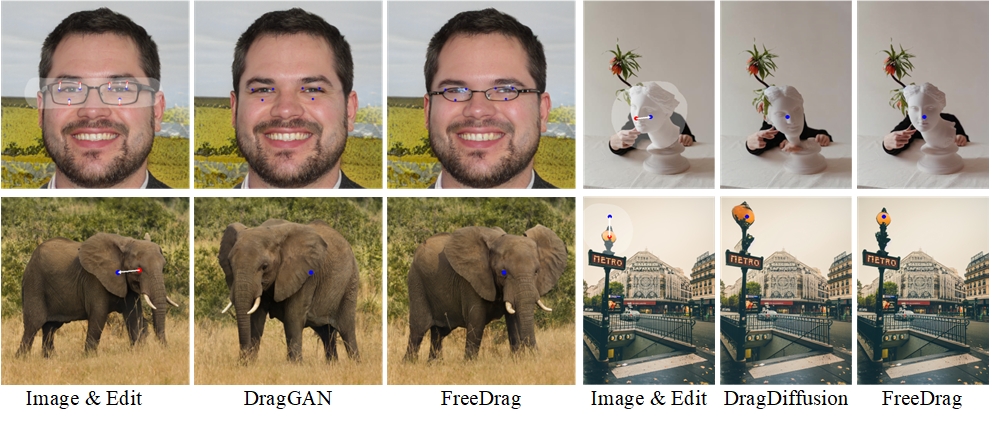
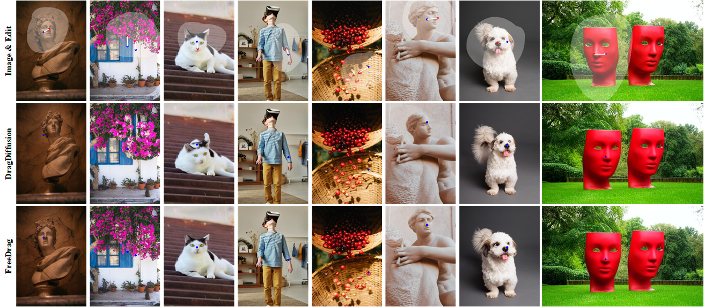
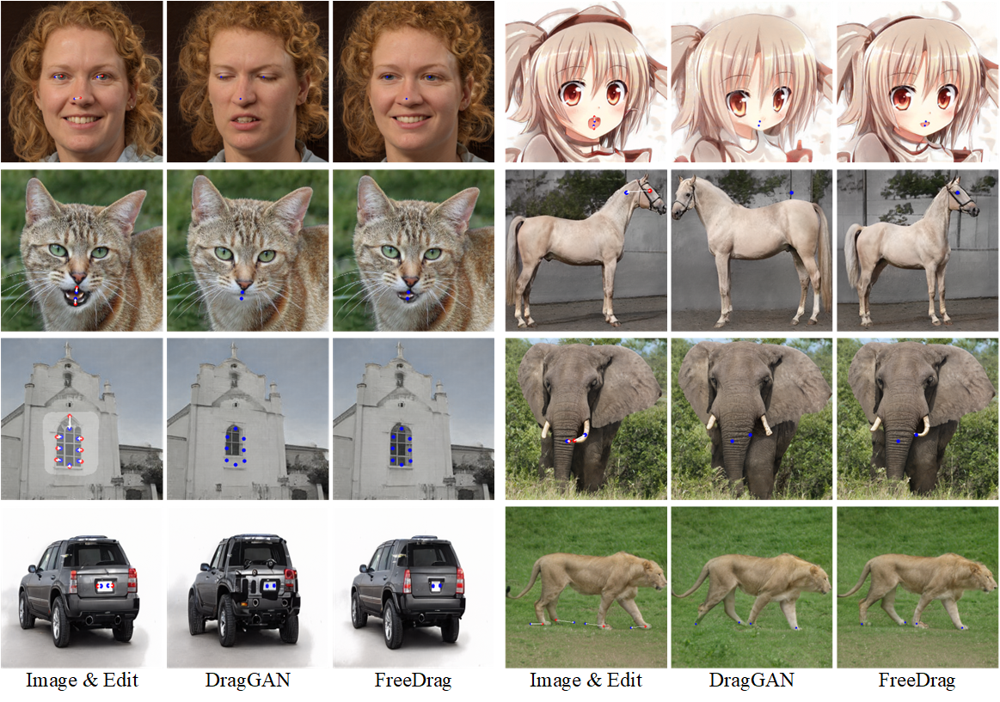
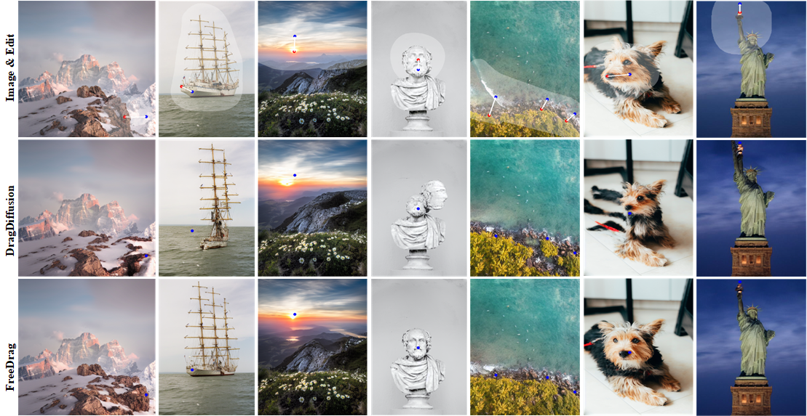

<p align="center">
  
</p>

# FreeDrag: Feature Dragging for Reliable Point-based Image Editing
<p align="center">
  
  
</p>

## Visualization 
[![]](https://user-images.githubusercontent.com/58554846/253733958-c97629a0-5928-476b-99f2-79d5f92762e7.mp4)


## Web Demo (online dragging editing in 11 different StyleGAN2 models)
[](https://openxlab.org.cn/apps/detail/LPengYang/FreeDrag)

Official implementation of **FreeDrag: Feature Dragging for Reliable Point-based Image Editing**.
- *Authors*: Pengyang Ling*, [Lin Chen*](https://lin-chen.site), [Pan Zhang](https://panzhang0212.github.io/), Huaian Chen, Yi Jin, Jinjin Zheng,
- *Institutes*: University of Science and Technology of China; Shanghai AI Laboratory
- [[Paper]](https://arxiv.org/abs/2307.04684) [[Project Page]](https://lin-chen.site/projects/freedrag) [[Web Demo]](https://openxlab.org.cn/apps/detail/LPengYang/FreeDrag)

This repo proposes FreeDrag, a novel interactive point-based image editing framework free of the laborious and unstable point tracking process🔥🔥🔥.


## Abstract
To serve the intricate and varied demands of image editing, precise and flexible manipulation in image content is indispensable. Recently, Drag-based editing methods have gained impressive performance. However, these methods predominantly center on point dragging, resulting in two noteworthy drawbacks, namely "miss tracking", where difficulties arise in accurately tracking the predetermined handle points, and "ambiguous tracking", where tracked points are potentially positioned in wrong regions that closely resemble the handle points. To address the above issues, we propose **FreeDrag**, a feature dragging methodology designed to free the burden on point tracking. The **FreeDrag** incorporates two key designs, i.e., template feature via adaptive updating and line search with backtracking, the former improves the stability against drastic content change by elaborately controls feature updating scale after each dragging, while the latter alleviates the misguidance from similar points by actively restricting the search area in a line. These two technologies together contribute to a more stable semantic dragging with higher efficiency. Comprehensive experimental results substantiate that our approach significantly outperforms pre-existing methodologies, offering reliable point-based editing even in various complex scenarios.

<p align="center">
  
  
</p>

## 📜 News
[2024/03/06] [FreeDrag](https://arxiv.org/abs/2307.04684) is accepted by CVPR 2024.

[2023/12/11] The updataed [FreeDrag](https://arxiv.org/abs/2307.04684) containing the implementations in both StyleGAN and Diffusion models is available now.

[2023/12/8]  FreeDrag based on diffusion model is available now, which support dragging editing in both real images and generated images.

[2023/7/31] The web demo (StyleGAN) in [OpenXLab](https://openxlab.org.cn/apps/detail/LPengYang/FreeDrag) is available now.

[2023/7/28] The function of real image editing is available now.

[2023/7/15] Code of local demo is available now!💥

[2023/7/11] The [paper](https://arxiv.org/abs/2307.04684) and [project page](https://lin-chen.site/projects/freedrag) are released!

## 💡 Highlights
- [x] Local demo of FreeDrag
- [x] Web demo of FreeDrag
- [x] Diffusion-based FreeDrag

## 🛠️Usage

First clone our repository
```
git clone --depth=1 https://github.com/LPengYang/FreeDrag
```
To create a new environment, please follow the requirements of [NVlabs/stylegan2-ada](https://github.com/NVlabs/stylegan2-ada-pytorch#requirements). 

**Notice:** It is observed that the errors (setting up PyTorch plugin “bias_act_plugin“... Failed or “upfirdn2d_plugin“... Failed) may appear in some devices, we hope these potential solutions ([1](https://blog.csdn.net/qq_15969343/article/details/129190607), [2](https://github.com/NVlabs/stylegan2-ada-pytorch/issues/155), [3](https://github.com/NVlabs/stylegan3/issues/124), [4](https://github.com/XingangPan/DragGAN/issues/106)) could be helpful in this case.

Then install the additional requirements

```
pip install -r requirements.txt
```

Then download the pre-trained models of stylegan2
```
bash download_models.sh
```
**Notice：**  The first model (face model) could be downloaded very slowly in some cases. In this case, it is suggested to restart the download (works sometimes) or directly download it from this [link](https://catalog.ngc.nvidia.com/orgs/nvidia/teams/research/models/stylegan2/files), please download the correct model (ffhq-512×512) and renamed it as "faces.pkl" and manually put it in the created checkpoints file (after all the other models are downloaded).

Finally initialize the gradio platform for interactive point-based manipulation

```
CUDA_LAUNCH_BLOCKING=1 python FreeDrag_gradio.py
```
You can also upload your images and then edit them. For a high-quality image inversion, it is suggested to make sure that the resolution and style (such as layout) of the uploaded images are consistent with the generated images of corresponding model. The resolution of different model is listed as follows:

|Model|face|horse|elephant|lion|dog|bicycle|giraffe|cat|car|church|metface|
|:----:|:---:|:---:|:---:|:---:|:---:|:---:|:---:|:---:|:---:|:---:|:---:|
|Resolution|512|256|512|512|1024|256|512|512|512|256|1024|

The proposed **FreeDragBench Dataset** is available on the [website](https://drive.google.com/file/d/1p2muR6aW6fqEGW8yTcHl86DCuUkwgtNY/view?usp=sharing).

## ❤️Acknowledgments
- [DragGAN](https://github.com/XingangPan/DragGAN/)
- [DragDiffusion](https://yujun-shi.github.io/projects/dragdiffusion.html)
- [StyleGAN2](https://github.com/NVlabs/stylegan2-ada-pytorch)
  
## License
All codes used or modified from [StyleGAN2](https://github.com/NVlabs/stylegan2-ada-pytorch) are under the [Nvidia Source Code License](https://github.com/NVlabs/stylegan3/blob/main/LICENSE.txt). 
The code related to the FreeDrag algorithm is only allowed for personal activity. The diffusion-based FreeDrag is implemented based on [DragDiffusion](https://yujun-shi.github.io/projects/dragdiffusion.html).

## ✒️ Citation
If you find our work helpful for your research, please consider citing the following BibTeX entry.
```bibtex
@inproceedings{ling2024freedrag,
  title={Freedrag: Feature dragging for reliable point-based image editing},
  author={Ling, Pengyang and Chen, Lin and Zhang, Pan and Chen, Huaian and Jin, Yi and Zheng, Jinjin},
  booktitle={Proceedings of the IEEE/CVF Conference on Computer Vision and Pattern Recognition},
  pages={6860--6870},
  year={2024}
}
```
