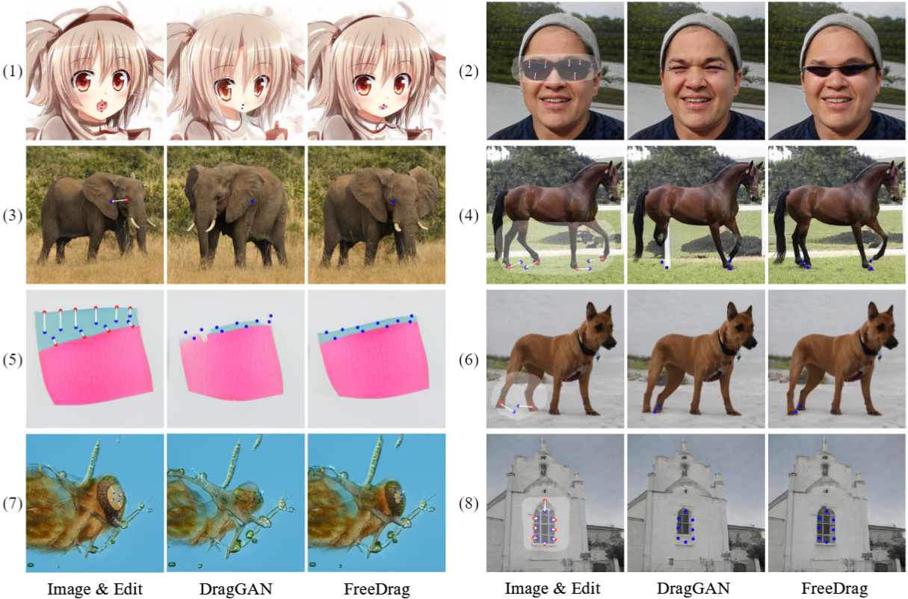

<p align="center">
  
</p>

# FreeDrag: Point Tracking is Not You Need for Interactive Point-based Image Editing
[![]](https://user-images.githubusercontent.com/58554846/253733958-c97629a0-5928-476b-99f2-79d5f92762e7.mp4)

Official implementation of **FreeDrag: Point Tracking is Not You Need for Interactive Point-based Image Editing**.
- *Authors*: Pengyang Ling*, [Lin Chen*](https://lin-chen.site), [Pan Zhang](https://panzhang0212.github.io/), Huaian Chen, Yi Jin
- *Institutes*: University of Science and Technology of China; Shanghai AI Laboratory
- [[Paper]](https://arxiv.org/abs/2307.04684) [[Project Page]](https://lin-chen.site/projects/freedrag) [Web Demo]

This repo proposes FreeDrag, a novel interactive point-based image editing framework free of the laborious and unstable point tracking process🔥🔥🔥.

## Abstract
To serve the intricate and varied demands of image editing, precise and flexible manipulation of image content is indispensable. Recently, DragGAN has achieved impressive editing results through point-based manipulation. 
However, we have observed that DragGAN struggles with miss tracking, where DragGAN encounters difficulty in effectively tracking the desired handle points, and ambiguous tracking, where the tracked points are situated within other regions that bear resemblance to the handle points. To deal with the above issues, we propose **FreeDrag**, which adopts a feature-oriented approach to free the burden on point tracking within the point-oriented methodology of DragGAN. The **FreeDrag** incorporates adaptive template features, line search, and fuzzy localization techniques to perform stable and efficient point-based image editing. Extensive experiments demonstrate that our method is superior to the DragGAN and enables stable point-based editing in challenging scenarios with similar structures, fine details, or under multi-point targets. 
<p align="center">
  
</p>

## 📜 News
[2023/7/28] The function of real image editing is available now. You can upload your images and then edit them as before. For a high-quality image inversion, it is suggested to make sure that the resolution and style (such as layout) of the uploaded images are consistent with the generated images of corresponding model. The resolution of different model is listed as follows:

|Model|face|horse|elephant|lion|dog|bicycle|giraffe|cat|car|church|metface|
|:----:|:---:|:---:|:---:|:---:|:---:|:---:|:---:|:---:|:---:|:---:|:---:|
|Resolution|512|256|512|512|1024|256|512|512|512|256|1024|

[2023/7/15] Code of local demo is available now!💥

[2023/7/11] The [paper](https://arxiv.org/abs/2307.04684) and [project page](https://lin-chen.site/projects/freedrag) are released!

## 💡 Highlights
- [x] Local demo of FreeDrag
- [ ] Web demo of FreeDrag
- [ ] Diffusion-based FreeDrag
- [ ] FreeDrag anything **3D**

## 🛠️Usage

First clone our repository
```
git clone --depth=1 https://github.com/LPengYang/FreeDrag
```
To create a new environment, please follow the requirements of [NVlabs/stylegan2-ada](https://github.com/NVlabs/stylegan2-ada-pytorch#requirements). 

**Notice:** It is observed that the errors (setting up PyTorch plugin “bias_act_plugin“... Failed or “upfirdn2d_plugin“... Failed) may appear in some devices, we hope these potential solutions ([1](https://blog.csdn.net/qq_15969343/article/details/129190607), [2](https://github.com/NVlabs/stylegan2-ada-pytorch/issues/155), [3](https://github.com/NVlabs/stylegan3/issues/124), [4](https://github.com/XingangPan/DragGAN/issues/106)) could be helpful in this case.

Then install the additional requirements

```
pip install -r requirements.txt
```

Then download the pre-trained models of stylegan2
```
bash download_models.sh
```
**Notice：**  The first model (face model) could be downed very slowly in some cases. In this case, you can restart the download (works sometimes) or you can directly download it from this [link](https://catalog.ngc.nvidia.com/orgs/nvidia/teams/research/models/stylegan2/files), please download the correct model (ffhq-512×512) and renamed it as "faces.pkl" and manually put it in the created checkpoints file (after all the other models are downloaded).

Finally initialize the gradio platform for interactive point-based manipulation

```
CUDA_LAUNCH_BLOCKING=1 python FreeDrag_gradio.py
```

## ❤️Acknowledgments
- [DragGAN](https://github.com/XingangPan/DragGAN/)
- [DragDiffusion](https://yujun-shi.github.io/projects/dragdiffusion.html)
- [StyleGAN2](https://github.com/NVlabs/stylegan2-ada-pytorch)
  
## License
All codes used or modified from [StyleGAN2](https://github.com/NVlabs/stylegan2-ada-pytorch) are under the [Nvidia Source Code License](https://github.com/NVlabs/stylegan3/blob/main/LICENSE.txt). 
The code related to the FreeDrag algorithm is only allowed for personal activity. For commercial use, please contact us.

## ✒️ Citation
If you find our work helpful for your research, please consider citing the following BibTeX entry.
```bibtex
@article{ling2023freedrag,
  title={FreeDrag: Point Tracking is Not You Need for Interactive Point-based Image Editing},
  author={Ling, Pengyang and Chen, Lin and Zhang, Pan and Chen, Huaian and Jin, Yi},
  journal={arXiv preprint arXiv:2307.04684},
  year={2023}
}
```

## 🌟 Star History
[](https://star-history.com/#LPengYang/FreeDrag&Date)
